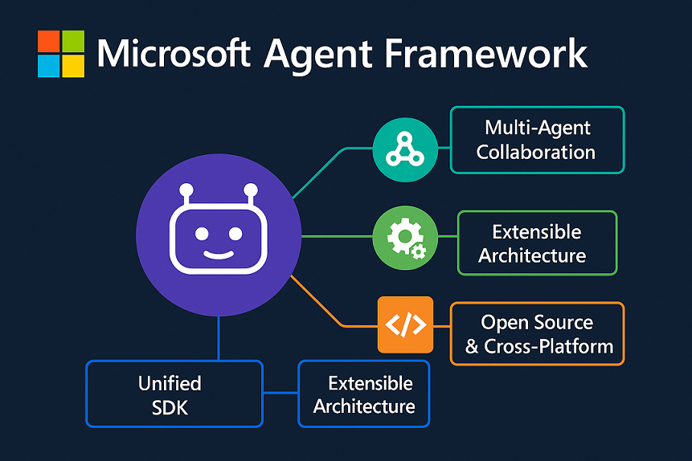

- [🚀 Microsoft Agent Framework Starter Pack](#-microsoft-agent-framework-starter-pack)
  - [Features](#features)
  - [📁 Repository Structure](#-repository-structure)
  - [Getting Started](#getting-started)
    - [Prerequisites](#prerequisites)
    - [Installation](#installation)
  - [Usage](#usage)
  - [🤝 Contributing](#-contributing)
  - [📄 License](#-license)
  - [🔗 Resources](#-resources)
  - [Repository Owner](#repository-owner)

# 🚀 Microsoft Agent Framework Starter Pack



The **MAF Starter Pack** is a template repository for building AI agents and workflows using the Microsoft Agent Framework (MAF). It provides a minimal, extensible foundation for rapid prototyping, training, evaluation, and deployment of agent-based solutions.

## Features

- Minimal working agent using Microsoft Agent Framework
- Modular code structure for easy extension
- Example orchestration flow and model definition
- Training and evaluation scripts
- Infrastructure as Code (Bicep) for cloud deployment
- Example data and tests included

## 📁 Repository Structure

```
MAF-Starter-Pack/
│   README.md                # Project overview and instructions
│   requirements.txt         # Python dependencies
│   LICENSE                  # License file
│
├── data/                    # Example datasets for training/evaluation
│   └── example_data.json    # Sample data for agent input/output
│
├── evaluations/             # Scripts for evaluating agents/models
│   └── evaluate_agent.py    # Example evaluation script
│
├── infra/                   # Infrastructure as Code (e.g., Bicep)
│   └── main.bicep           # Example Bicep template
│
├── src/                     # Source code for agent, model, training, utils
│   ├── agent.py             # Minimal working agent
│   ├── flow.py              # Example orchestration flow
│   ├── model.py             # Model definition
│   ├── train.py             # Training script
│   └── utils.py             # Utility functions
│
└── tests/                   # Test cases and configuration
	 ├── test_agent.py        # Example agent test
	 └── conftest.py          # Pytest configuration
```

## Getting Started

### Prerequisites

- Python 3.8+
- [Microsoft Agent Framework Core](https://pypi.org/project/agent-framework-core/)

### Installation

1. Clone the repository:
	```bash
	git clone https://github.com/your-org/maf-starter-pack.git
	cd maf-starter-pack
	```
2. Install dependencies:
	```bash
	pip install -r requirements.txt
	```

## Usage

- Modify `src/agent.py` to customize your agent logic.
- Use `src/train.py` to train models with your data in `data/`.
- Evaluate your agent with `evaluations/evaluate_agent.py`.
- Run tests with:
  ```bash
  pytest
  ```

## 🤝 Contributing

We welcome contributions! Please feel free to submit issues, feature requests, or pull requests.

## 📄 License

This project is licensed under the MIT License - see the LICENSE file for details.

## 🔗 Resources

- [Microsoft Agent Framework Documentation](https://github.com/microsoft/agent-framework)
- [Azure AI Services](https://azure.microsoft.com/en-us/products/ai-services)
- [Microsoft Foundry](https://azure.microsoft.com/en-us/products/ai-foundry)
- [GitHub Models](https://github.com/marketplace/models)

## Repository Owner

Korkrid Kyle Akepanidtaworn, Agents Factory Lead, Microsoft Corporation

---

**Start your journey with Microsoft Agent Framework today!** 🚀